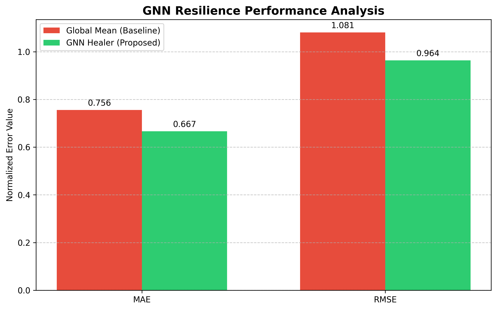
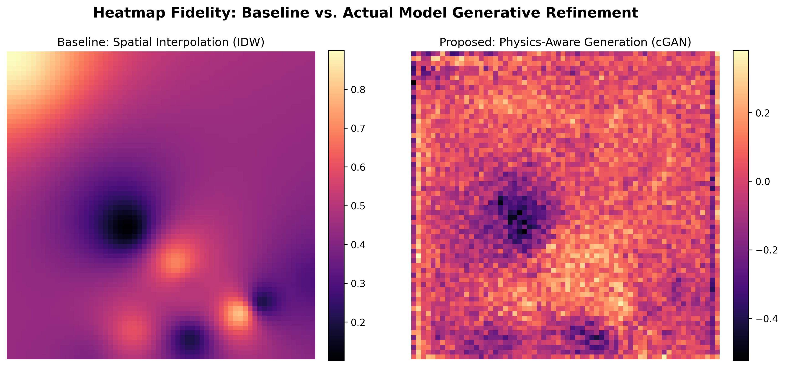

<p align="center">
  <h1 align="center">🌫️ AirSense</h1>
  <p align="center">
    <strong>AI-Powered Air Quality Monitoring & Simulation Platform for Mumbai</strong>
  </p>
  <p align="center">
    <a href="#architecture">Architecture</a> •
    <a href="#models">Models</a> •
    <a href="#dashboard">Dashboard</a> •
    <a href="#getting-started">Getting Started</a> •
    <a href="#results">Results</a>
  </p>
</p>

---

## 📌 Overview

AirSense is a real-time air quality monitoring and simulation platform built for **Mumbai's urban sensor network**. It combines **Graph Neural Networks** for sensor resilience with **Conditional GANs** for spatial pollution simulation, all served through an interactive web dashboard.

The system addresses two critical problems in urban air quality infrastructure:

1. **Sensor Failure Resilience** — When a hardware sensor crashes, the GNN reconstructs its data stream in real-time using spatial context from neighboring nodes.
2. **Policy Impact Simulation** — A physics-aware cGAN generates high-fidelity pollution heatmaps under user-defined scenarios (traffic reduction, industrial controls, wind conditions).

---

## 🏗️ Architecture

```
Mumbai_AQI_Cleaned.csv
        │
        ▼
  ┌──────────────┐       ┌──────────────────┐
  │ process_data │──────▶│ mumbai_tensor.npy│
  │    .py       │       │ (3D: Hours×10×7) │
  └──────────────┘       └────────┬─────────┘
                                  │
                    ┌─────────────┼─────────────┐
                    ▼                           ▼
          ┌─────────────────┐         ┌──────────────────┐
          │  train_healer   │         │   simulator.py   │
          │  (GNN - GAT)    │         │   (cGAN - WGAN)  │
          └────────┬────────┘         └────────┬─────────┘
                   │                           │
                   ▼                           ▼
          gnn_healer.pt              cgan_generator.pt
                   │                           │
                   └───────────┬───────────────┘
                               ▼
                      ┌─────────────────┐
                      │    main.py      │
                      │  (FastAPI API)  │
                      └────────┬────────┘
                               ▼
                      ┌─────────────────┐
                      │  Dashboard UI   │
                      │  (index.html)   │
                      └─────────────────┘
```

---

## 🧠 Models

### 1. GNN Healer — Graph Attention Network (GAT)

**Purpose**: Reconstruct missing sensor data when hardware fails.

| Detail | Value |
|---|---|
| Architecture | 3-layer GAT (4 heads) |
| Input | 10 nodes × 7 features (PM2.5, PM10, NO₂, CO, Temp, Wind Speed, Wind Dir) |
| Output | 4 pollutant channels per node |
| Graph Construction | Haversine distance threshold (5 km) on 10 Mumbai GPS coordinates |
| Training Strategy | Random 20% node masking per timestep |

The model learns spatial correlations between sensor nodes through multi-head attention over a geographically-constructed graph, enabling it to impute crashed sensor readings from healthy neighbors.

### 2. cGAN — Conditional Generative Adversarial Network

**Purpose**: Generate high-resolution pollution dispersion heatmaps.

| Detail | Value |
|---|---|
| Generator | U-Net with skip connections + Self-Attention bottleneck |
| Discriminator | PatchGAN with Instance Normalization |
| Training | WGAN-GP (Wasserstein + Gradient Penalty) + L1 loss |
| Input Conditioning | 4 channels: PM2.5 heatmap (IDW), traffic density, wind speed, wind direction |
| Output | 64×64 pollution dispersion map (upscaled to 1024×1024 for display) |

Sensor-level readings are spatially interpolated via **Inverse Distance Weighting (IDW)** using projected GPS coordinates, then refined by the generator to produce physics-aware heatmaps.

---

## 🖥️ Dashboard

The interactive dashboard provides:

- 🗺️ **Live Map** — Real-time sensor overlay on Mumbai with AQI color coding
- 🔥 **Pollution Heatmap** — cGAN-generated dispersion layer with IQAir-standard coloring
- ⚙️ **Policy Simulator** — Adjustable sliders for traffic density, industrial output, and wind conditions
- 🛡️ **Sensor Failure Simulation** — Click any sensor to simulate crash & view GNN reconstruction
- 🤖 **AI Insights** — LLM-powered environmental analysis and recommendations (via Groq API)

---

## 📊 Results

Evaluated on a held-out 20% test set from the Mumbai AQI dataset:

### GNN Sensor Imputation

| Method | MAE ↓ | RMSE ↓ |
|---|---|---|
| Global Mean (Baseline) | 0.7556 | 1.0809 |
| **GAT (Proposed)** | **0.6667** | **0.9636** |
| **Improvement** | **11.8%** | **10.8%** |

### cGAN Heatmap Generation

| Metric | Value |
|---|---|
| cGAN–IDW Fidelity (MSE) | 3.5055 |

<p align="center">
  
  
</p>

---

## 🚀 Getting Started

### Prerequisites

- Python 3.10+
- pip

### Installation

```bash
# Clone the repository
git clone https://github.com/tvi13/AirSense.git
cd AirSense

# Create and activate virtual environment
python -m venv venv
source venv/bin/activate  # On Windows: venv\Scripts\activate

# Install dependencies
pip install -r requirements.txt
```

### Environment Variables

```bash
# Copy the example env file
cp .env.example .env

# Edit .env and add your Groq API key (required for AI insights feature)
# GROQ_API_KEY=your_groq_api_key_here
```

> Get a free API key from [Groq Console](https://console.groq.com/)

### Running the Dashboard

```bash
python main.py
```

Open your browser at **http://localhost:8000**

### Training Models (Optional)

The repository includes pre-trained model weights. To retrain from scratch:

```bash
# Step 1: Process raw data into tensor format
python process_data.py

# Step 2: Train GNN Healer
python train_healer.py

# Step 3: Train cGAN Simulator
python simulator.py

# Step 4: Evaluate both models
python evaluate_models.py

# Step 5: Generate report visualizations
python generate_report_visuals.py
```

---

## 📁 Project Structure

```
AirSense/
├── main.py                     # FastAPI server & API endpoints
├── train_healer.py             # GNN (GAT) training pipeline
├── simulator.py                # cGAN (WGAN-GP) training pipeline
├── graph_utils.py              # Spatial graph construction (Haversine)
├── process_data.py             # Raw CSV → 3D tensor pipeline
├── evaluate_models.py          # Model evaluation & metrics
├── generate_report_visuals.py  # Publication-quality figures
├── requirements.txt            # Python dependencies
├── .env.example                # Environment variable template
│
├── Mumbai_AQI_Cleaned.csv      # Source dataset (10 sensors, hourly)
├── mumbai_tensor.npy           # Processed 3D tensor (Hours × 10 × 7)
├── mumbai_tensor_flattened.csv # Flattened 2D version for inspection
│
├── gnn_healer.pt               # Pre-trained GAT weights
├── cgan_generator.pt           # Pre-trained Generator weights
├── edge_index.pt               # Precomputed spatial graph edges
├── norm_stats.npy              # Dataset normalization statistics
├── traffic_map.npy             # Static traffic density map
├── pm25_max.npy                # PM2.5 normalization constant
│
├── gnn_performance.png         # GNN evaluation bar chart
├── gnn_imputation_demo.png     # Sensor failure reconstruction trace
├── cgan_comparison.png         # IDW vs cGAN heatmap comparison
├── wind_physics.png            # Wind direction physics validation
├── metrics_report.txt          # Quantitative evaluation results
│
└── static/
    └── index.html              # Dashboard frontend (single-page app)
```

---

## 🔧 Tech Stack

| Layer | Technology |
|---|---|
| ML Framework | PyTorch, PyTorch Geometric |
| GNN | Graph Attention Network (GATConv) |
| GAN | WGAN-GP with U-Net Generator |
| Backend | FastAPI, Uvicorn |
| Frontend | Vanilla HTML/CSS/JS, Leaflet.js |
| AI Insights | Groq API (LLaMA 3.1) |
| Data Source | Mumbai AQI + Open-Meteo Weather API |

---

## 📚 Key Concepts

- **Graph Attention Networks (GAT)** — Multi-head attention mechanism over spatial sensor graphs for learning anisotropic node importance
- **Wasserstein GAN with Gradient Penalty (WGAN-GP)** — Stable adversarial training with Lipschitz continuity enforcement
- **Inverse Distance Weighting (IDW)** — Deterministic spatial interpolation from point measurements to gridded fields
- **Haversine Distance** — Great-circle distance computation for constructing geographically-aware sensor connectivity

---

## 👤 Author

**Tvisha Majithia**

---

<p align="center">
  Built with PyTorch 🔥 and FastAPI ⚡
</p>
